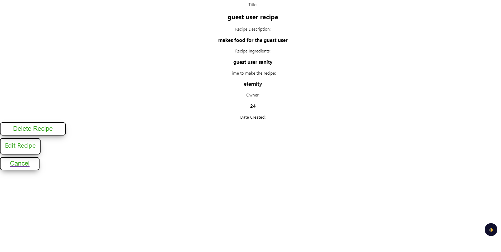
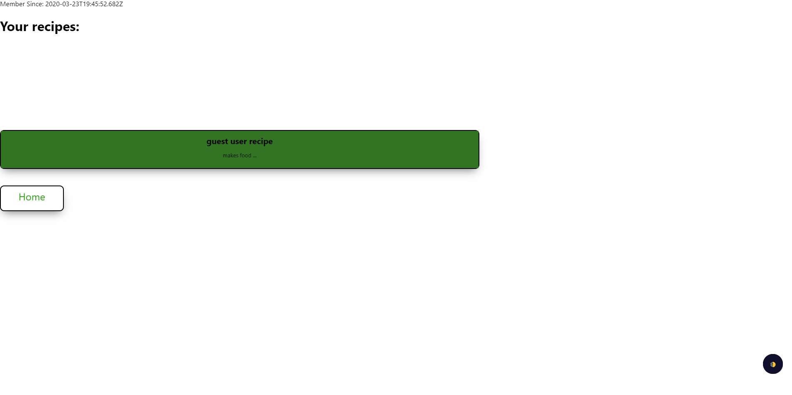

# Kitchen Helper:

    Kitchen Helper is a best friend in the kitchen.
    This app combines the ability to create, edit, and add your own recipes.
    

## Author:

- Calvin Rosehart

## Motivation:

    The motivation for this app was the idea that it would
    help those that wish to be more organized and pro-active
    in the kitchen.  It takes the guess work out of wondering
    what you have in your kitchen to create meals.  So, if
    you are someone who forgets easily, a busy parent that
    feels frazzled about what to cook, or an older couple
    looking to try something new, this app has something for everyone.
    

## Visit Kitchen Helper:

  * [Server Side Repo](https://github.com/thinkful-ei-iguana/kitchen-helper)

  * [Live App](https://kitchen-helper-front-end.now.sh/)

## Screenshots:

   

   

      

   

   
   
   
   
   

   

## Technologies:

**Front End Tech:** HTML, CSS, JavaScript, React, Widgets(Dark Mode)

**Back End Tech:** NodeJs, ExpressJs, PostgreSQL

**Testing Tech:** Jest, Supertest, Snapshot, Enzyme, Lodash, Mocha, Chai

## Core Features:

- Ability to create/login with user accounts

- Ability to display recipes, create new recipes

- Ability to edit and delete recipes

- Ability to display prep time and ingredients needed from the selected recipe

## Code Example:

    Code snippet For Editing a recipe

handleEditSuccess = () => {
    const { history } = this.props;
    history.push(`/recipe/${this.state.recipe.id}`);
  };

  editSubmit = e => {
    e.preventDefault();
    try {
      let { title, recipe_description, recipe_ingredients, time_to_make } = e.target;

      this.setState({ error: null });
      RecipeHelper.updateRecipe(
        {
          title: title.value,
          owner: this.context.currentUser.id,
          recipe_description: recipe_description.value,
          recipe_ingredients: recipe_ingredients.value,
          time_to_make: time_to_make.value,
        },
        this.state.recipe.id
      )
        .then(recipe => {
          if (!recipe.ok) { this.setState({ error: !recipe.ok }) }
          else {
            title.value = "";
            recipe_description.value = "";
            recipe_ingredients.value = "";
            time_to_make.value = "";
            this.handleEditSuccess();
          }
        })
